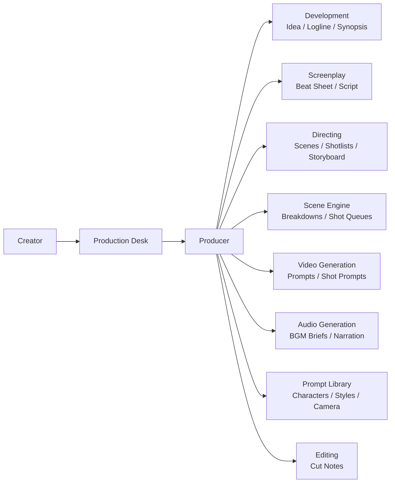

# movie-studio-plugin

Claude Code 上で AI ショートムービー制作ワークフローを構築するプラグイン。
AIと会話しながら短編映像の方向性を固め、脚本・映像生成・音響生成まで整理できます。

LLM・動画生成AI・音楽AI・AI音声などを組み合わせて、ショートムービー制作の流れを **企画 → 脚本 → 演出 → 生成 → 編集 → 公開** まで一貫して管理できます。

`/movie` を実行すると制作デスクが窓口となり、あなたの作品制作に合わせた制作体制を立ち上げます。日常運用では、制作デスクに相談するだけで、必要に応じてプロデューサーが各制作部門へタスクを振り分けます。

---

## Architecture



---

## できること

* アイデアをログラインに整理する
* シノプシスやビートシートを作る
* 脚本ドラフトを段階的に育てる
* シーン、ショットリスト、絵コンテメモを管理する
* 動画生成AI用のショットプロンプトを整理する
* 音楽AI / AI音声向けの音響ブリーフを整理する
* シーンを生成AI向けのショット単位に分解する
* 編集ノートや制作メモを一元管理する
* 制作タスクを日次・週次で整理する
* 映像生成AI用の再利用可能プロンプトを管理する
* キャラクター・映像スタイル・カメラプリセットを共有する
* 生成済み素材の採用状況やバージョンを管理する
* 書き出し・字幕・公開チェックまで整理する
* 外部実行環境やジョブ定義を管理する
* 作品のテーマやエスプリを整理し、一貫して反映する
* 世界観やキャラクターのバックボーンをナレッジとして蓄積する

---

## インストール

```bash
/plugin marketplace add cardcapt/movie-studio-plugin
/plugin install movie-studio@movie-studio-plugin
```

---

## クイックスタート

```text
/movie
```

例:

* 5〜15分程度の AI ショートムービーを作りたい
* 映像は動画生成AI、音楽は音楽AI、ナレーションはAI音声で作りたい
* 映画祭応募や YouTube 公開を目指している
* 第1幕の構成やシーン整理、ショット設計で悩んでいる

初回実行時にはオンボーディングが始まり、`.movie-studio/` フォルダが生成されます。
このフォルダには制作体制、テンプレート、タスク、メモ、プロンプト資産などの制作データが整理されます。

---

## コンセプト

```text
あなた → 制作デスク（窓口） → プロデューサー（振り分け） → 各制作部門
```

* **制作デスク**: 常に窓口。企画相談、TODO 整理、メモ、壁打ちを担当
* **プロデューサー**: 裏方で判断。必要に応じて各制作部門へ自動振り分け
* **各制作部門**: 企画開発、脚本、演出、映像生成、音響生成、編集、プロンプト管理、シーン分解などの専門領域を担当

ユーザーは各制作部門を意識する必要はありません。
制作デスクに話しかけるだけで、AIショートムービー制作の流れに沿って必要な作業が整理されます。

---

## 使い方

### 初回セットアップ

```text
> /movie

制作デスク: はじめまして！制作デスクです。
            どんな映像作品を作りたいですか？
あなた: 8分くらいのSFショートムービーを作りたいです

制作デスク: どんな映像スタイルを目指しますか？
あなた: 実写映画風で、少し夢っぽい雰囲気にしたいです

制作デスク: 主にどのAIを使って制作したいですか？
あなた: 脚本は LLM、映像は動画生成AI、音楽は音楽AI を考えています

制作デスク: 今困っていることはありますか？
あなた: ログラインはあるけど、シーン分解と映像プロンプト化が難しいです

制作デスク: おすすめの制作体制はこちらです:
            制作デスク, プロデューサー, 企画開発, 脚本, 演出, シーン分解, 映像生成, 音響生成, 編集, プロンプト管理
            いかがですか？
あなた: OK

→ `.movie-studio/` フォルダが生成され、制作体制・タスク・メモ・プロンプト資産などの制作データが管理されます
```

### 日常の運営

```text
> /movie
制作デスク: おはようございます！今日は何を進めますか？

> 主人公が雨の夜に駅で立ち尽くすシーンを作りたい

制作デスク: 承知しました。
            まずシーン分解でショット構成を整理し、必要なら映像生成向けプロンプトまで作ります。

> 今日やること教えて

制作デスク: 今日の制作TODOです:
  最優先:
  - [ ] ログラインを1案に絞る
  - [ ] scene-003 をショット単位に分解する
  通常:
  - [ ] shot-003 用の動画生成プロンプトを調整する
  - [ ] BGM brief を1件作る
```

---

## AIショートムービー制作フロー

```text
conversation
↓
direction
↓
logline
↓
synopsis
↓
script
↓
scene plan
↓
shot design
↓
video prompts
↓
audio prompts
↓
edit plan
↓
short movie
```

制作デスクに相談することで、各工程を前後しながらも全体の流れを見失わずに進められます。

---

## 制作部門一覧

AIショートムービー制作に対応した制作部門の例です。
プロジェクトに応じて柔軟に構成できます。

| 部門                         | 担当領域                         | 常設 |
| -------------------------- | ---------------------------- | -- |
| 制作デスク                      | TODO 管理、相談受付、メモ、進行整理         | はい |
| プロデューサー                    | 方針判断、部門振り分け、優先順位整理           | はい |
| レビュー                       | 日次・週次の振り返り、改善点整理             | はい |
| 企画開発 (`development`)       | ログライン、テーマ、企画整理、参考作品調査        | 任意 |
| 脚本 (`screenplay`)          | プロット、ビートシート、脚本、台詞            | 任意 |
| 演出 (`directing`)           | シーン設計、演出意図、ショット方針            | 任意 |
| シーン分解 (`scene-engine`)     | シーンの分解、生成順序、映像と音の組み立て整理      | 任意 |
| 映像生成 (`video-generation`)  | 動画生成AI向けプロンプト、ショット別指示、スタイル調整 | 任意 |
| 音響生成 (`audio-generation`)  | BGM brief、効果音、ナレーション設計       | 任意 |
| 編集 (`editing`)             | 構成、テンポ、シーケンス整理、カットノート        | 任意 |
| プロンプト管理 (`prompt-library`) | キャラクター、スタイル、カメラ、ネガティブプロンプト管理 | 任意 |
| 美術 (`art`)                 | 世界観、ロケーション、衣装、小道具            | 任意 |
| 配給 / PR (`distribution`)   | タイトル案、紹介文、予告編方針、告知           | 任意 |

---

## 生成されるプロジェクト構造

`/movie` 実行後には、作業用フォルダ `.movie-studio/` が生成されます。

```text
.movie-studio/
├── CLAUDE.md
├── production-desk/
├── producer/
├── reviews/
├── development/
├── screenplay/
├── directing/
├── video-generation/
├── audio-generation/
├── editing/
├── prompt-library/
├── scene-engine/
├── art/
└── distribution/
```

主要な役割:

* `development/`: ログライン、シノプシス、参考資料
* `screenplay/`: ビートシート、アウトライン、脚本ドラフト
* `directing/`: シーン設計、ショットリスト、絵コンテメモ
* `scene-engine/`: シーン分解、ショット順、組み立てノート
* `video-generation/`: 動画生成AI用プロンプト、ショット別指示
* `audio-generation/`: BGM brief、ナレーション、音響設計
* `editing/`: 構成メモ、カットノート
* `prompt-library/`: 再利用可能なプロンプト資産
* `asset-ledger/`: 生成済み映像・音声素材の採用状況、再生成判定、バージョン管理
* `delivery/`: 書き出し、字幕、公開チェック、納品準備
* `mcp-runtime/`: 外部接続先、ジョブ、実行メモの管理

---

## リポジトリ構成

```text
movie-studio-plugin/
├── .claude-plugin/
│   └── marketplace.json
├── plugins/
│   └── movie-studio/
│       ├── .claude-plugin/
│       │   └── plugin.json
│       └── skills/
│           └── movie-studio/
│               ├── SKILL.md
│               └── references/
│                   ├── claude-md-template.md
│                   ├── departments.md
│                   └── templates/
├── README.md
└── LICENSE
```

---

## ライセンス

MIT
