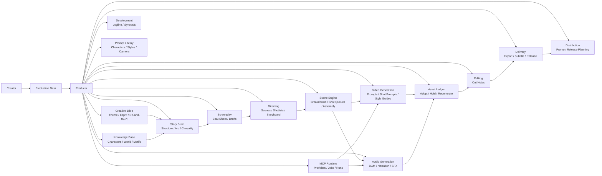

# movie-studio-plugin

AIと会話しながら短編映像の方向性を固め、脚本・映像生成・音響生成・素材管理・納品準備まで一貫して整理する **Claude Code プラグイン**。

LLM・動画生成AI・音楽AI・AI音声などを組み合わせて、ショートムービー制作の流れを **企画 → 構造設計 → 脚本 → シーン分解 → 生成 → 評価 → 編集 → 納品 / 公開** まで管理できます。

`/movie` を実行すると制作デスクが窓口となり、あなたの作品制作に合わせた制作体制を立ち上げます。日常運用では、制作デスクに相談するだけで、必要に応じてプロデューサーが各制作部門へタスクを振り分けます。

---

## Architecture



---

## できること

* アイデアをログラインに整理する
* シノプシスやビートシートを作る
* 脚本ドラフトを段階的に育てる
* 作品のテーマ、エスプリ、美意識を固定する
* 世界観、人物背景、モチーフ、時間軸を管理する
* ストーリー構造、キャラクターアーク、因果関係を整理する
* シーンをショット単位に分解する
* 動画生成AI用のショットプロンプトを整理する
* 音楽AI / AI音声向けの音響ブリーフを整理する
* 再利用可能なプロンプト資産を蓄積する
* 生成素材を採用 / 保留 / 再生成で管理する
* 編集ノートや制作メモを一元管理する
* 書き出し、字幕、公開準備を整理する
* 外部ツール実行やプロバイダ管理の土台を持てる

---

## なぜ movie-studio か

AI動画生成ツールは多い一方で、**映画制作の構造そのもの**を扱えるツールは多くありません。

`movie-studio` は、AIショートムービー制作を単なる

```text
prompt → video
```

ではなく、

```text
theme
↓
world
↓
story
↓
scene
↓
shot
↓
video / audio
↓
asset selection
↓
edit
↓
delivery
```

という **映画制作の流れ** で扱います。

そのため、単発の生成ではなく、**作品としての一貫性** を保ちながら進められます。

---

## インストール

```bash
/plugin marketplace add cardcapt/movie-studio-plugin
/plugin install movie-studio@movie-studio-plugin
```

---

## クイックスタート

```text
/movie
```

例:

* 5〜15分程度の AI ショートムービーを作りたい
* 映像は動画生成AI、音楽は音楽AI、ナレーションはAI音声で作りたい
* 映画祭応募や YouTube 公開を目指している
* 第1幕の構成やシーン整理、ショット設計で悩んでいる

初回実行時にはオンボーディングが始まり、`.movie-studio/` フォルダが生成されます。
このフォルダには制作体制、テンプレート、タスク、メモ、プロンプト資産、生成素材の評価ログなどの制作データが整理されます。

---

## コンセプト

```text
あなた → 制作デスク（窓口） → プロデューサー（振り分け） → 各制作部門
```

* **制作デスク**: 常に窓口。企画相談、TODO整理、メモ、壁打ちを担当
* **プロデューサー**: 裏方で判断。必要に応じて各制作部門へ自動振り分け
* **各制作部門**: 作品の核、背景知識、構造、脚本、演出、生成、評価、納品までの専門領域を担当

ユーザーは各制作部門を意識する必要はありません。
制作デスクに話しかけるだけで、AIショートムービー制作の流れに沿って必要な作業が整理されます。

---

## 使い方

### 初回セットアップ

```text
> /movie

制作デスク: はじめまして！制作デスクです。
            どんな映像作品を作りたいですか？
あなた: 8分くらいのSFショートムービーを作りたいです

制作デスク: どんな映像スタイルを目指しますか？
あなた: 実写映画風で、少し夢っぽい雰囲気にしたいです

制作デスク: 主にどのAIを使って制作したいですか？
あなた: 脚本は LLM、映像は動画生成AI、音楽は音楽AI を考えています

制作デスク: 今困っていることはありますか？
あなた: ログラインはあるけど、シーン分解と映像プロンプト化が難しいです

制作デスク: おすすめの制作体制はこちらです:
            制作デスク, プロデューサー, 企画開発, 作品の核, 背景知識, ストーリー構造, 脚本, 演出, シーン分解, 映像生成, 音響生成, 編集, プロンプト管理, 素材管理, 納品公開
            いかがですか？
あなた: OK

→ `.movie-studio/` フォルダが生成され、制作体制・タスク・メモ・プロンプト資産・評価ログなどの制作データが管理されます
```

### 日常の運営

```text
> /movie
制作デスク: おはようございます！今日は何を進めますか？

> 主人公が雨の夜に駅で立ち尽くすシーンを作りたい

制作デスク: 承知しました。
            まずストーリー構造とシーン分解を確認し、必要なら映像生成向けプロンプトまで作ります。

> 今日やること教えて

制作デスク: 今日の制作TODOです:
  最優先:
  - [ ] ログラインを1案に絞る
  - [ ] scene-003 をショット単位に分解する
  通常:
  - [ ] shot-003 用の動画生成プロンプトを調整する
  - [ ] BGM brief を1件作る
```

---

## AIショートムービー制作フロー

```text
conversation
↓
direction
↓
logline
↓
synopsis
↓
story structure
↓
script
↓
scene plan
↓
shot design
↓
video prompts
↓
audio prompts
↓
generated assets
↓
asset selection
↓
edit plan
↓
short movie
↓
delivery / release
```

制作デスクに相談することで、各工程を前後しながらも全体の流れを見失わずに進められます。

---

## 制作部門一覧

AIショートムービー制作に対応した制作部門の例です。
プロジェクトに応じて柔軟に構成できます。

| 部門      | 実際の部門名             | 担当領域                         | 常設 |
| ------- | ------------------ | ---------------------------- | -- |
| 制作デスク   | `production-desk`  | TODO管理、相談受付、メモ、進行整理          | はい |
| プロデューサー | `producer`         | 方針判断、部門振り分け、優先順位整理           | はい |
| レビュー    | `reviews`          | 日次・週次の振り返り、改善点整理             | はい |
| 企画開発    | `development`      | ログライン、シノプシス、企画整理、参考作品調査      | 任意 |
| 作品の核    | `creative-bible`   | テーマ、エスプリ、美意識、do-and-don't    | 任意 |
| 背景知識    | `knowledge-base`   | 世界観、人物背景、モチーフ、場所、時系列         | 任意 |
| ストーリー構造 | `story-brain`      | 物語構造、キャラクターアーク、因果、問い         | 任意 |
| 脚本      | `screenplay`       | プロット、ビートシート、脚本、台詞            | 任意 |
| 演出      | `directing`        | シーン設計、演出意図、ショット方針            | 任意 |
| シーン分解   | `scene-engine`     | シーンの分解、生成順序、映像と音の組み立て        | 任意 |
| 映像生成    | `video-generation` | 動画生成AI向けプロンプト、ショット別指示、スタイル調整 | 任意 |
| 音響生成    | `audio-generation` | BGM brief、効果音、ナレーション設計、音響方針  | 任意 |
| 編集      | `editing`          | 構成、テンポ、シーケンス整理、カットノート        | 任意 |
| プロンプト管理 | `prompt-library`   | キャラクター、スタイル、カメラ、ネガティブプロンプト管理 | 任意 |
| 素材管理    | `asset-ledger`     | 採用 / 保留 / 再生成、バージョン管理、比較記録   | 任意 |
| 納品・公開   | `delivery`         | 書き出し、字幕、公開チェック、プラットフォーム別管理   | 任意 |
| MCP実行管理 | `mcp-runtime`      | 外部ツール実行、プロバイダ設定、ジョブ管理、実行ログ   | 任意 |
| 美術      | `art`              | 世界観、ロケーション、衣装、小道具、ビジュアル      | 任意 |
| 配給 / PR | `distribution`     | タイトル案、紹介文、予告編方針、告知、公開計画      | 任意 |

---

## 生成されるプロジェクト構造

`/movie` 実行後には、作業用フォルダ `.movie-studio/` が生成されます。

```text
.movie-studio/
├── CLAUDE.md
├── production-desk/
├── producer/
├── reviews/
├── failure-log/
├── development/
├── creative-bible/
├── knowledge-base/
├── story-brain/
├── screenplay/
├── directing/
├── scene-engine/
├── video-generation/
├── audio-generation/
├── editing/
├── prompt-library/
├── asset-ledger/
├── delivery/
├── mcp-runtime/
├── art/
└── distribution/
```

主要な役割:

* `creative-bible/`: 作品のテーマ、エスプリ、美意識、表現ルール
* `knowledge-base/`: 世界観、キャラクター背景、モチーフ、場所、時間軸
* `story-brain/`: 物語構造、キャラクターアーク、ドラマの核、因果関係
* `screenplay/`: ビートシート、アウトライン、脚本ドラフト
* `directing/`: シーン設計、ショットリスト、絵コンテメモ
* `scene-engine/`: シーン分解、ショット順、組み立てノート
* `video-generation/`: 動画生成AI用プロンプト、ショット単位の実行指示
* `audio-generation/`: BGM brief、ナレーション、効果音設計
* `asset-ledger/`: 採用 / 保留 / 再生成、比較、バージョン履歴
* `delivery/`: 書き出し、字幕、公開前チェック、プラットフォーム別管理
* `mcp-runtime/`: 外部プロバイダ、ジョブ、実行ログ、ワークフロー実行
* `failure-log/`: 失敗パターン、学び、再発防止ルール

---

## 運用ルールの考え方

このプラグインでは、生成前後の運用ルールも重視しています。

### 参照強制

新しい生成や提案の前に、必要に応じて以下を参照します。

* `creative-bible/`
* `knowledge-base/`
* `story-brain/`

### シーン→プロンプト変換

シーンはそのまま生成せず、必ず

```text
story
↓
scene
↓
shot
↓
prompt
```

の流れで分解します。

### 評価ループ

生成して終わりではなく、

```text
generate
↓
evaluate
↓
revise / regenerate
↓
adopt
↓
log failure if needed
```

のループを回します。

### バージョン管理

重要成果物は上書きせず、`v1 / v2 / v3` や `scene-003-v2.md` のように分岐管理します。

### 監督フィードバック処理

監督の修正要望は、

* 作品の核
* 設定
* 構造
* 演出
* 実生成
* 素材採否

のどの層に関わるかを判定して反映します。

---

## リポジトリ構成

```text
movie-studio-plugin/
├── .claude-plugin/
│   └── marketplace.json
├── plugins/
│   └── movie-studio/
│       ├── .claude-plugin/
│       │   └── plugin.json
│       └── skills/
│           └── movie-studio/
│               ├── SKILL.md
│               └── references/
│                   ├── claude-md-template.md
│                   ├── departments.md
│                   └── templates/
├── README.md
└── LICENSE
```

---

## 向いている用途

* AI短編映画
* コンセプト映像
* 雰囲気重視の映像詩
* 実験映像
* 映画祭向け短編
* YouTube / SNS向けの短編映像企画
* 監督の抽象的な要望を構造化して反映したい制作

---

## ライセンス

MIT
